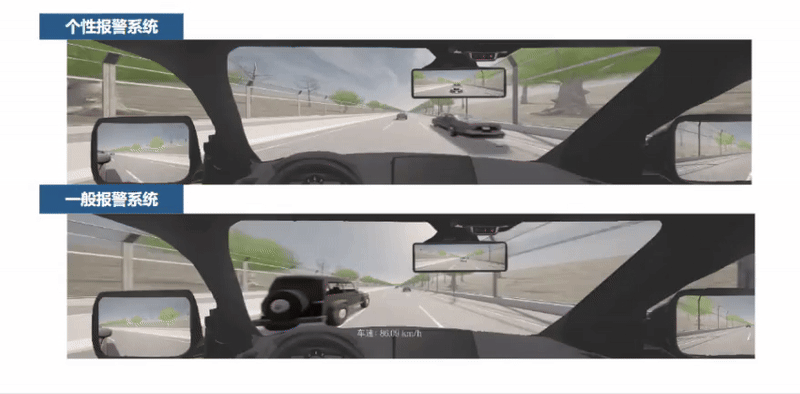

一、驾驶员行为解析：根据训练得到的驾驶员规则输出驾驶员行为解析

通过迭代asp学到的驾驶员规则越来越合理
loop9的asp

loop0的asp

二、车辆安全防护算法增强:
在三随机挑战（随机时间、随机地点、随机挑战类型）场景下，个性化预警系统可以很好地帮助驾驶员成功避险
在三随机场景下我们会控制1辆BV对AV发起指定挑战。定量精细控制BV发起某种挑战。
实验额外用纸笔记录每次挑战的效果、驾驶员的满意程度。
通过三重随机避免学习效应。
通过IDM交通流制造丰富的环境数据。
通过traci接口控制背景车发起可控挑战。

开启个性化预警系统后驾驶员的驾驶片段

未开启个性化预警系统后驾驶员的驾驶片段

驾驶员在驾驶模拟器中的一个预警避险片段

